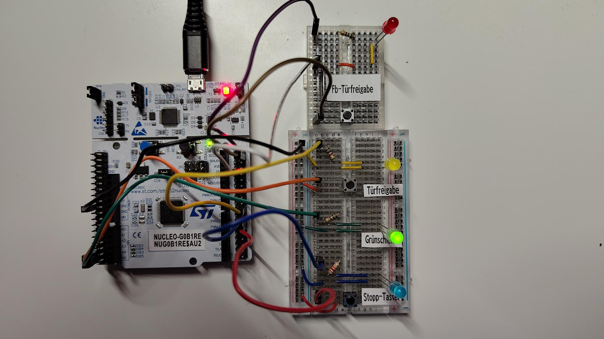
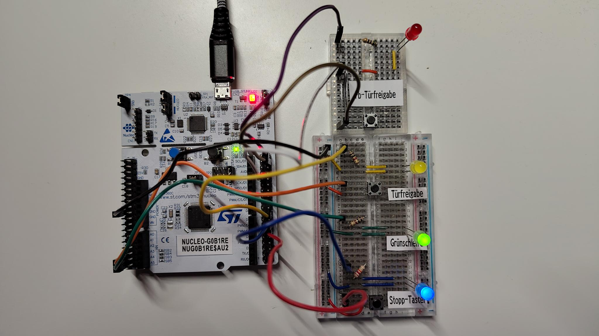
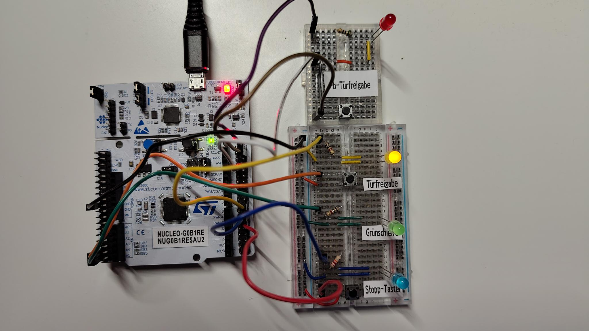
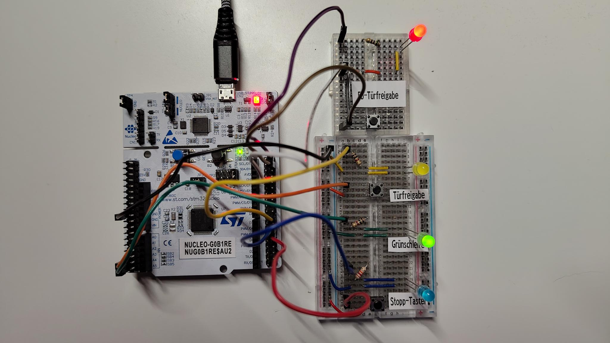

# Tram Safety Control Prototype

This repository documents the design and implementation of a rail-oriented embedded safety project inspired by real tram operating procedures.

The project focuses on safety-critical local door control logic, modeled and implemented on STM32. The long-term goal is to extend the system into a distributed multi-node architecture using CAN communication.

## Current Milestone
26.05.2026
A first hardware-validated proof of concept has been achieved for the 'node-door-controller'.

The current implementation covers the local safety and interaction logic for:
- door_release (Türfreigabe)
    - allows door opening when station is detected and the vehicle is stopped
- fallback_door_release (Fb-Türfreigabe)
    - allows door opening when station detection failed, but driver considers situation safe (vehicle needs to be stopped as well)
- stop_request (Haltewunsch)
    - is set when a passenger presses the Stopp-Button
    - opens doors when either (or even both) of the door releases has been activated successfully
- door (Tür)
    - are represented by the so called Green-Loop-LED
    - green light indicates that all doors are closed

The logic has been implemented on an STM32 Nucleo-G0B1RE and tested on real hardware (breadboard, LEDs, push-buttons) which represents the basic door control present in a real tram.
The observed hardware behaviour matches the modeled and intended software behaviour.

At this stage, the node-door-controller is a standalone local proof of concept:
- local supervisor logic is implemented
- fundamental state transitions are modeled and implemented in firmware
- button inputs and LED outputs are wired and validated on hardware
- the interaction between door release, fallback door release, stop request and door supervision behaves as expected

### Current limitations:
While this milestone represents a local proof of concept, it is not the complete distributed system.

- remote sources are mocked
    - vehicle_movement and station_detection are not yet read from other nodes, but hard coded in the communication-directory -> changing the values there produces the expected, functionally correct outputs on the hardware and in the UART-interface
- implementation of other nodes (e.g. node-drive-controller) do not yet exist
- CAN-communication is missing completely at this point

### Hardware Validation
Images of the current state are stored at `docs/progress/node-door-controller/20260526_proof_of_concept`.

all doors closed, no stop request set, no active door release

passenger stop request is set while door remain closed

door release was activated, doors open -> stop request is reset

example showing that regular door release and fallback door release are handled independently

---

Following is a more detailed project description in German:

## Projektursprung
Bei meiner Arbeit als Straßenbahnfahrer kamen mir zwei Ideen, von denen ich mir erhoffe, dass sie die Sicherheit der Fahrgäste, Fahrer und Personen im Umfeld der Straßenbahn erhöhen können.
Da ich Angewandte Informatik studiere, möchte ich versuchen, diese Ideen in einem industrienahen Modell umzusetzen.

## Projektbeschreibung
Das Gesamtprojekt ist in zwei Teile gegliedert.

### 1. Teil
Grundlage:
Die Türüberwachung der mir bekannten Straßenbahnen ist bereits sehr weit entwickelt. Eine Freigabe der Türen ist beispielsweise nur möglich, wenn sich die Bahn im Stillstand befindet. Wenn während der Fahrt mindestens eine Tür duch Dritte geöffnet wird, verlangsamt das Fahrzeug automatisch und der Fahrer wird gewarnt. Auch ein Anfahren ist nicht möglich, während noch mindestens eine Tür geöffnet oder die Türfreigabe aktiv ist.
Des Weiteren haben die Zustände der Türen bzw. des Türfreigabetasters - je nach Modell und Hersteller - auch Einfluss auf die Schaltung der Lichtsignalanlagen (LSA). LSA, die nah hinter einer Haltestelle sind, werden beispielsweise angefordert, sobald nach dem Fahrgastwechsel das erste Mal alle Türen der Bahn wieder geschlossen sind. Durch die Anforderung erhält die Straßenbahn an der nächsten Kreuzung Priorität. Es gibt auch Bahnen, bei denen die Anforderung geschickt wird, wenn der Türfreigabetaster herausgenommen wird, also die Türen nicht mehr von den Fahrgästen per Knopfdruck geöffnet werden können.

Problemstellung:
Die Fahrer nutzen den Türfreigabetaster, um die Anforderung an der nächsten LSA auszulösen. An vielen Haltestellen ist das exakt so vorgesehen und wird in der Ausbildung so vermittelt.
Allerdings kann es passieren, dass dieser Ablauf - "Türfreigabe schnell erneut setzen für Anforderung" - dazu führt, dass dies auch an LSAs genutzt wird, an denen das nicht vorgesehen ist, verursacht beispielsweise durch Gewöhnungseffekte. Für die Fahrgäste entsteht das Risiko, dass sich die Türen unerwartet öffnen könnten, was besonders außerhalb des Haltestellenbereich nah am Individualverkehr (IV) zu gefährlichen Situationen führen kann..

Lösungsidee:
Das System bestimmt an Hand von Sensordaten, ob sich das Fahrzeug vollständig innerhalb eines Haltestellenbereichs befindet.
- Fahrzeug innerhalb des Haltestellenbereichs: Türfreigabetaster verhält sich wie im Regelbetrieb
- Fahrzeug außerhalb des Haltestellenbereichs: Regelbetrieb des Türfreigabetaster wird unterdrückt, der Fahrer wird informiert
Für Notfälle oder Störungen wird zusätzlich eine separate Fallback-Türfreigabe implementiert, welche bewusst vom regulären Türfreigabetaster getrennt ist, um beispielsweise zügige Evakuierungen oder bei Ausfall der Haltstellen-Sensortechnik einen normalne Fahrgastwechsel zu ermöglichen.

### 2. Teil
Grundlage:
Viele Lichtsignalanlagen verhalten sich in ihrer Schaltung "immer" wieder gleich. Dadurch können sich bei Fahrern Gewöhnungseffekte einstellen.

Problemstellung:
Sei es auf Grund von Gewöhnung, durch eine kurze Unaufmerksamkeit oder eine Fehleinschätzung - Fahrer können Halt zeigende Signale zu spät wahrnehmen oder gar komplett übersehen. Dies geschieht sehr selten. Da menschliche Fehler aber nicht vollständig vermeidbar sind, kommt es in Folge solcher Momente zu besonders gefährlichen Situationen.

Lösungsidee:
Bereitstellung von streckenseitigen Signalinformationsmodulen, welche folgende Informationen bereitstellen:
- Identifikation der spezifischen LSA
- Entfernung zur LSA
- aktueller Signalzustand (F0 bis F5)
- verbleibende Zeit bis zum Signalwechsel

Beim Überfahren dieses Moduls liest ein System in der Bahn diese Informationen aus und verarbeitet sie gemeinsam mit den Fahrdaten der Bahn, z.B. Geschwindigkeit und Beschleunigung. Auf Basis dieser Daten wird ermittelt, welches Signal an der LSA aktiv ist, wenn die Bahn diese erreicht.
Im Rahmen dieses Projekts wird in einem solchen Fall eine Warnung an den Fahrer ausgegeben, falls das Signal F0 zeigen würde. Weiterführende Maßnahmen (automatische Bremsung oder Quittierungslogik) sind denkbar, werden aus Komplexitätsgründen zunächst aber nicht umgesetzt.

### Technologien
Für den ersten Teil des Projekts werden mindestens folgende Komponenten benötigt:
- 2 Microcontroller
- 2 CAN-Module
- ca. 1m Kabel (vorläufig aus Ethernetkabeln) zur Verbindung der CAN-Module
- 2 Abschlusswiderstände (120 Ohm)
- weitere elektronische Teile (LEDs, Push-Buttons, Potentiometer etc.)

### Vorgehensweise
Stand 18.05.2026
#### 1. Projekt-Teil
1. Grundlegende Funktionalitäten implementieren
    1. Modellieren der Zustandsautomaten der Fachlogik (Stopp-Taster, Türen, Türfreigabe, Fallback-Türfreigabe, Fahrzustand etc.)
    2. Zusammensetzung der zugrundeliegenden Hardware (inkl. softwareseitig z.B. Entprellen von Buttons)
    3. Implementierung in C der verschiedenen Zustandsautomaten
    4. Fachlogik modellieren (Interlocks) und implementieren
    5. CAN-Bus-Kommunikation einrichten
2. Erweiterte Funktionalität implementieren
    1. Haltestellenbereich simulieren + Zustand der Bahn (in Haltestelle oder nicht in Haltestelle)
    2. Abhängigkeit der Türfreigabe von Zustand der Bahn
    3. Störungs-/Not-Türfreigabe implementieren

## Projektziele
Ziel ist, neben Studium und Arbeit, das Projekt fachlich korrekt und möglichst vollständig zu bearbeiten.
Insbesonders soll praxisnahe Erfahrung in folgenden Bereichen gesammelt werden:
- Embedded-Programmierung
- verteilte Systemarchitektur
- CAN-Kommunikation
- sicherheitsorientierte Systemlogik

## Hinweis zur Nutzung von KI
Zur Unterstützung meines eigenen Lernprozesses setze ich Künstliche Intelligenzen ein, sei es als Hilfe bei der Programmierung oder generell zur Unterstützung beim Erlernen von Fachwissen.
Die klare Bedingung ist allerdings: Jeglicher Code im Projekt wird von mir verstanden, überprüft und verantwortet.